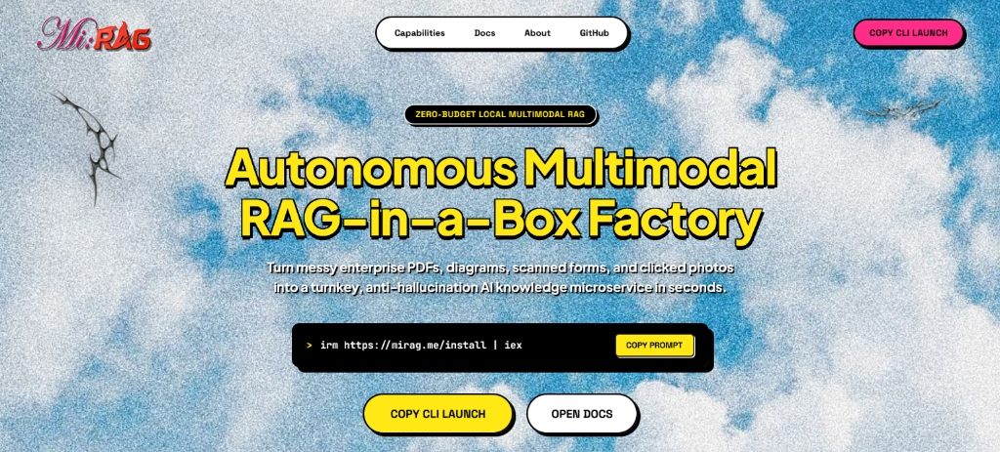

# Mi:RAG

Local document search and question answering with multimodal diagram extraction and visual search.



---

## What is Mi:RAG?

Mi:RAG is a local-first Retrieval-Augmented Generation (RAG) application. It indexes documents (PDFs, Word documents, text files, and images) directly on your machine, extracts both text passages and visual diagrams, and lets you ask questions about them through a web interface.

By default, everything runs locally using [Ollama](https://ollama.com) for language models and [ChromaDB](https://www.trychroma.com) for vector storage — no data leaves your computer, and no API keys are required. If you want to use cloud models, optional BYOK (Bring Your Own Key) connections are available for OpenAI, Gemini, Claude, Groq, and OpenRouter.

---

## Why Mi:RAG Exists

Most document RAG tools have two common limitations:

1. **They ignore visual information**: Standard text chunkers extract plain text and discard charts, diagrams, architectural drawings, and formulas. In technical, scientific, or financial documents, the key information is often in the figures.
2. **They depend on external APIs**: Many tools send your documents to third-party cloud APIs for parsing, embedding, and completion, creating privacy concerns and recurring API costs.

Mi:RAG addresses both problems:
- It detects and crops figures, charts, and diagrams from pages, indexing them alongside text.
- It supports **reverse visual search**: you can paste or upload an image (like a flowchart or diagram) to find matching figures in your documents.
- It runs entirely on your local hardware using open-source models.

---

## Main Features

- **Document Ingestion**: Supports PDF, DOCX, TXT, MD, CSV, and common image formats (PNG, JPG, WEBP).
- **Diagram & Figure Extraction**: Automatically detects and extracts visual figures and charts from PDF pages with high-resolution crops.
- **Reverse Visual Search**: Paste (Ctrl+V) or upload an image to find matching figures, diagrams, and formulas across indexed documents.
- **Local-First Inference**: Runs local LLMs (such as Llama 3.2, Qwen 2.5, Mistral) via Ollama with zero mandatory internet connection.
- **Grounded Answers & Citations**: Cross-references claims against retrieved source chunks and displays source cards with page numbers and image previews.
- **Flexible Embedding Models**: Select from local HuggingFace embedding models (`BAAI/bge-base-en-v1.5`, `all-MiniLM-L6-v2`, `BAAI/bge-m3`, `nomic-embed-text-v1.5`) based on your hardware.
- **Standalone Package Export**: Export any indexed session as a self-contained ZIP bundle with an embedded vector store, FastAPI server, and chat UI that can run offline on other machines.
- **Optional Cloud APIs**: Support for OpenAI, Google Gemini, Anthropic Claude, xAI Grok, and OpenRouter when larger models are preferred.

---

## How It Works (The 6-Level Pipeline)

Mi:RAG processes documents through a multi-stage pipeline designed to preserve both written text and visual figures:

```text
[ User Document: PDF / DOCX / Image ]
                 │
                 ▼
┌────────────────────────────────────────────────────────┐
│ LEVEL 1: INGESTION & DIAGRAM EXTRACTION                │
│ • PyMuPDF extracts text streams and geometric layouts  │
│ • Raster and vector paths (>80px) cropped as figures   │
│ • RapidOCR extracts embedded text within cropped images│
└────────────────────────┬───────────────────────────────┘
                         │
                         ▼
┌────────────────────────────────────────────────────────┐
│ LEVEL 2: CHUNKING & METADATA BINDING                   │
│ • Recursive text chunking (target size ~400 chars)     │
│ • Surrounding figure captions matched via regex window │
│ • Associated image URLs and metadata bound to chunks   │
└────────────────────────┬───────────────────────────────┘
                         │
                         ▼
┌────────────────────────────────────────────────────────┐
│ LEVEL 3: DUAL-INDEX VECTOR & VISUAL STORAGE            │
│ • Text chunks embedded via BAAI/bge-base-en-v1.5       │
│ • Text vectors indexed in isolated ChromaDB collection │
│ • Extracted figures indexed via perceptual hash        │
│   (pHash/dHash) for deduplication & reverse search     │
└────────────────────────┬───────────────────────────────┘
                         │
                         ▼
                   [ User Query ]
            (Natural Language or Image)
                         │
                         ▼
┌────────────────────────────────────────────────────────┐
│ LEVEL 4: HYBRID RETRIEVAL & SCORING                    │
│ • Dense vector similarity search across ChromaDB       │
│ • BM25 lexical keyword overlap calculation             │
│ • Visual fingerprint matching for image inputs         │
│ • Candidate ranking via combined scoring formula       │
└────────────────────────┬───────────────────────────────┘
                         │
                         ▼
┌────────────────────────────────────────────────────────┐
│ LEVEL 5: ANTI-HALLUCINATION & REFUSAL GATES            │
│ • Content word lexical check against retrieved chunks  │
│ • Cosine similarity gate (refuses if below threshold)  │
│ • Out-of-domain query short-circuiting                 │
└────────────────────────┬───────────────────────────────┘
                         │
                         ▼
┌────────────────────────────────────────────────────────┐
│ LEVEL 6: GENERATION & GROUNDED CITATIONS               │
│ • Context injected into local Ollama model (3B/7B)     │
│ • Streamed response with inline figure cards           │
│ • Grounded badge with source file and page citations   │
└────────────────────────────────────────────────────────┘
```

---

## Tech Stack

| Layer | Technology |
| :--- | :--- |
| **Backend** | Python 3.10+, FastAPI, Uvicorn |
| **Vector Database** | ChromaDB (in-process, persistent) |
| **Document Parsing** | PyMuPDF (fitz), python-docx, Pillow |
| **OCR & Vision** | RapidOCR, optional Ollama vision models (e.g. `qwen2.5vl:3b`, `llava`) |
| **Embedding Models** | SentenceTransformers (`BAAI/bge-base-en-v1.5`, `all-MiniLM-L6-v2`, etc.) |
| **Local LLMs** | Ollama |
| **Frontend** | Vanilla HTML5, CSS3, JavaScript (no external framework build step) |

---

## Prerequisites

- **Python**: 3.10 or higher
- **Ollama**: Installed and running ([ollama.com](https://ollama.com))
- **Operating System**: Windows 10/11, macOS, or Linux

Before running Mi:RAG, pull at least one text model in Ollama:

```bash
ollama pull llama3.2:3b
```

*(Optional: For image OCR and visual reasoning, you can also pull `ollama pull qwen2.5vl:3b`)*

---

## Setup & Installation

### Option 1: Quick Install Script

#### Windows (PowerShell)
```powershell
irm https://mirag.me/install | iex
```

#### Linux & macOS (Bash)
```bash
curl -fsSL https://mirag.me/install.sh | bash
```

The install script checks your Python and Ollama installations, sets up a virtual environment, installs dependencies, and launches the application.

---

### Option 2: Manual Installation

```bash
# 1. Clone the repository
git clone https://github.com/AryanSingh64/Mi-RAG.git
cd Mi-RAG

# 2. Create and activate a virtual environment
python -m venv .venv

# On Windows:
.venv\Scripts\activate
# On Linux/macOS:
source .venv/bin/activate

# 3. Install dependencies
pip install -r requirements.txt

# 4. Start the server
python run_factory.py
```

Once started, open **`http://localhost:8000`** in your browser.

---

## Configuration

Mi:RAG works out of the box with default settings, but you can configure it via environment variables or a `.env` file:

| Variable | Default | Description |
| :--- | :--- | :--- |
| `HOST` | `127.0.0.1` | Host address to bind the web server |
| `PORT` | `8000` | Port number for the web server |
| `OLLAMA_BASE_URL` | `http://localhost:11434` | URL of the local Ollama instance |
| `DEFAULT_EMBED_MODEL`| `BAAI/bge-base-en-v1.5` | Default SentenceTransformers embedding model |
| `SESSION_TTL_HOURS` | `3` | Default lifetime (in hours) before inactive sessions expire |

If using optional cloud providers, you can supply API keys through the UI settings modal or via environment variables (`OPENAI_API_KEY`, `GEMINI_API_KEY`, `ANTHROPIC_API_KEY`, `GROQ_API_KEY`).

---

## How to Use

1. **Open the Studio**: Navigate to `http://localhost:8000/studio` in your browser.
2. **Choose Models**: Select your text model (from your installed Ollama models) and your preferred embedding model.
3. **Upload Documents**: Drag and drop your PDFs, Word documents, or images into the upload area. You can select specific page ranges if you only want to index part of a large document.
4. **Index Documents**: Click **Index Documents**. The backend extracts text and diagram crops, generates vector embeddings, and stores them in ChromaDB.
5. **Ask Questions**: Click **Open Chat Assistant** to enter the chat interface. Type questions in natural language. Answers include source citations showing the document name and page number.
6. **Reverse Visual Search**: In the chat, click the attachment icon (or paste with Ctrl+V) to upload a diagram or image. The system finds matching figures in your documents and answers questions about them.
7. **Export (Optional)**: Click **Export Standalone** in the sidebar to download a self-contained ZIP archive containing your indexed vector database, extracted images, server script, and chat UI.

---

## Project Structure

```text
Mi-RAG/
├── core/                       # Core RAG logic
│   ├── config.py               # Hardware detection & runtime configuration
│   ├── guardrails/             # Anti-hallucination checks & source grounding
│   ├── ingestion/              # PDF/DOCX parsers, diagram crop extraction, OCR
│   ├── models/                 # Model registry & provider integrations
│   ├── pipeline.py             # Query processing, retrieval, and response generation
│   └── vectorstore/            # ChromaDB management & image visual matcher
├── server/                     # FastAPI backend
│   ├── api/                    # Route handlers for sessions, chat, upload, export
│   └── main.py                 # FastAPI application definition & middleware
├── web/                        # Web interface
│   ├── static/                 # CSS, JavaScript, icons, and assets
│   └── templates/              # HTML templates (app, portal, index, docs)
├── run_factory.py              # Application entrypoint
├── requirements.txt            # Python dependencies
└── README.md                   # Project documentation
```

---

## Embedding Model Guide

| Model ID | Dimensions | Hardware Recommendation | Best For |
| :--- | :--- | :--- | :--- |
| `BAAI/bge-base-en-v1.5` | 768 | CPU or GPU (Balanced) | General use; strong retrieval accuracy across technical and standard documents. |
| `all-MiniLM-L6-v2` | 384 | Low-spec CPU / Minimal RAM | Fastest indexing speed with low memory usage. |
| `BAAI/bge-m3` | 1024 | GPU recommended | Multilingual documents across 100+ languages. |
| `BAAI/bge-large-en-v1.5` | 1024 | GPU recommended | High semantic precision for dense academic or scientific papers. |
| `nomic-ai/nomic-embed-text-v1.5` | 768 | CPU or GPU | Long document passages with up to 8192-token context. |

---

## REST API Summary

The server exposes standard REST endpoints for programmatic access:

| Method | Endpoint | Description |
| :--- | :--- | :--- |
| `POST` | `/api/sessions` | Creates an isolated session with its own ChromaDB collection |
| `POST` | `/api/sessions/{id}/upload` | Uploads and indexes a document for the session |
| `POST` | `/api/sessions/{id}/chat` | Sends a text or image query and returns grounded responses |
| `POST` | `/api/sessions/{id}/clear_memory` | Clears conversation history for the session |
| `GET` | `/api/sessions/{id}/images/{file}` | Serves extracted diagram crops and figures |
| `GET` | `/api/sessions/{id}/export` | Downloads the standalone ZIP bundle |

---

## Limitations & Architectural Trade-offs

This project is built as a fast, local-first prototype designed to run on everyday laptops without requiring GPU clusters. To achieve sub-second response times on host CPUs, the current implementation relies on several engineering heuristics that have specific limitations:

1. **Ingestion & Caption Association**:
   - *Current Implementation*: PyMuPDF locates diagrams by checking raster objects and vector drawing dimensions (>80px), associating captions using a 2,500-character window around image coordinates.
   - *Limitation*: In complex multi-column academic papers or technical manuals, the physical reading order diverges from the internal stream order. The 2,500-character window can capture body text from an adjacent column or miss a caption placed below the figure.
2. **Chunk Size & Semantic Fragmentation**:
   - *Current Implementation*: Text is chunked using a `RecursiveCharacterTextSplitter` with a 400-character target and 60-character overlap.
   - *Limitation*: 400 characters (~50–70 words) is compact and fast to embed, but complex technical explanations, mathematical proofs, or multi-row tables can get sliced mid-thought. Injecting image tags like `[IMAGE / FIGURE: ...]` into these short chunks can consume 30% or more of the embedding token budget.
3. **Visual Matching (Perceptual Hash vs. Semantic Vision)**:
   - *Current Implementation*: Extracted figures are indexed using perceptual hashes (`pHash` and `dHash`) with normalized Hamming distance matching.
   - *Limitation*: Perceptual hashing detects exact or near-duplicate images (e.g. verifying if an uploaded screenshot matches an indexed diagram). However, it cannot perform natural-language semantic visual search (e.g., querying *"show me the circuit diagram for the power supply"* requires matching the surrounding text caption, not the image pixels directly).
4. **Scoring Combinations & Embedding Anisotropy**:
   - *Current Implementation*: The retriever combines dense cosine similarity, keyword overlap, and figure presence using fixed weights (`0.65 Cos + 0.08 Lex + 0.12 Fig`). A static similarity threshold is used to refuse out-of-domain questions.
   - *Limitation*: Dense transformer embeddings naturally exhibit "anisotropy" (the cone effect), where cosine similarity scores cluster in a narrower range rather than spreading uniformly across -1 to +1. Fixed similarity thresholds may occasionally admit borderline noise or reject valid paraphrases that lack literal keyword overlap.
5. **Local Model Capacity**:
   - *Current Implementation*: Defaults to compact local models like `llama3.2:3b` or `qwen2.5:3b`.
   - *Limitation*: While 3B models run smoothly on standard laptops, they have harder limits on complex multi-step reasoning, dense tabular navigation, and fine-grained visual chart reading compared to 14B+ parameter models or dedicated vision-language models.

---

## Production Optimization Blueprint

For high-throughput enterprise deployments with dedicated GPU infrastructure, the system can be upgraded from lightweight heuristics to learned document models across all 6 levels:

| Pipeline Level | Prototype Implementation (Current) | Production Target (Enterprise Blueprint) | Primary Failure Mode Addressed |
| :--- | :--- | :--- | :--- |
| **Level 1: Ingestion & Layout** | PyMuPDF coordinate heuristics, 80px vector threshold, 2500-char regex window | **Docling** (RT-DETR layout + TableFormer) or **MinerU** (DocLayout-YOLO) | Inverted reading orders, broken multi-column captions, sharded vector paths. |
| **Level 2: Chunking & Context** | Fixed 400-char recursive splitting, inline string tag injection | **Parent-Child Indexing** (128-token child / 1024-token parent) or **Late Chunking** (Jina AI 8k context) | Mid-sentence semantic fragmentation, pronoun loss (anaphora), embedding tag dilution. |
| **Level 3: Visual Indexing** | Perceptual hashing (`pHash`/`dHash`) with Hamming distance | **Unified Multimodal Latent Space** (SigLIP / ColPali late-interaction ViT); pHash kept for deduplication | Inability to do text-to-image semantic search; sensitivity to crops and rotations. |
| **Level 4: Hybrid Retrieval** | Ad-hoc linear combination (`0.65 Cos + 0.08 Lex + 0.12 Fig`) | **Reciprocal Rank Fusion (RRF, $k=60$)** combining BM25 + dense vectors, followed by **Cross-Encoder Reranker** (`bge-reranker-large`) | Score scale incompatibilities; vector topology distortion; lack of full token cross-attention. |
| **Level 5: Guardrails & Refusal**| Literal content-word match + static cosine cutoff ($\ge 0.35$) | **Calibrated Z-Score Normalization** against corpus distribution + **NLI Entailment Classifier** (Vectara HHEM-2.1) | False rejections on valid synonyms; out-of-domain noise leaks due to embedding anisotropy. |
| **Level 6: Generation & Attribution** | Ollama 3B models (`llama3.2:3b`) with self-eval confidence score | **Qwen-2.5-14B** or **Qwen-2.5-VL-7B/72B** with **Atomic Claim-Level Faithfulness** (Ragas / TruLens) | Chart interpretation hallucinations; sycophantic self-eval; broken markdown image links. |

### Architectural Roadmap Details

#### 1. Layout-Aware Ingestion
Replacing raw coordinate heuristics with **Docling** allows the parser to construct an explicit Document Object Model (Abstract Syntax Tree). Figures and their authentic captions are bound structurally rather than by spatial distance windows, eliminating caption misattribution in multi-column research papers.

#### 2. Late Chunking for Context Preservation
Standard chunking segments text before passing it to the embedding model, losing cross-boundary context. Under **Late Chunking**, the full document passage (up to 8,192 tokens) is processed through the transformer encoder in a single pass. Boundary pooling is then applied to the token representations, preserving document-wide attention and resolving pronouns without requiring artificial overlaps.

#### 3. Reciprocal Rank Fusion & Cross-Encoder Reranking
Rather than adding unnormalized keyword bonuses to angular cosine distances, modern hybrid retrieval runs dense vector search and sparse BM25 in parallel, combining their ordinal rankings via Reciprocal Rank Fusion:
$$RRF(d) = \sum_{m \in M} \frac{1}{k + r_m(d)}$$
The top 30 candidates from RRF are then evaluated by a cross-encoder reranker (`bge-reranker-large`), enabling full cross-attention between query and document tokens before passing the top 5 excerpts to the language model.

#### 4. Claim-Level Factual Attribution
Instead of relying on self-assessment prompts, production grounding extracts individual atomic claims from the generated answer and tests them against the retrieved source chunks using a Natural Language Inference (NLI) sequence classifier (such as Vectara HHEM-2.1). The resulting faithfulness percentage represents verified factual entailment.

---

## License

This project is licensed under the [MIT License](LICENSE).
